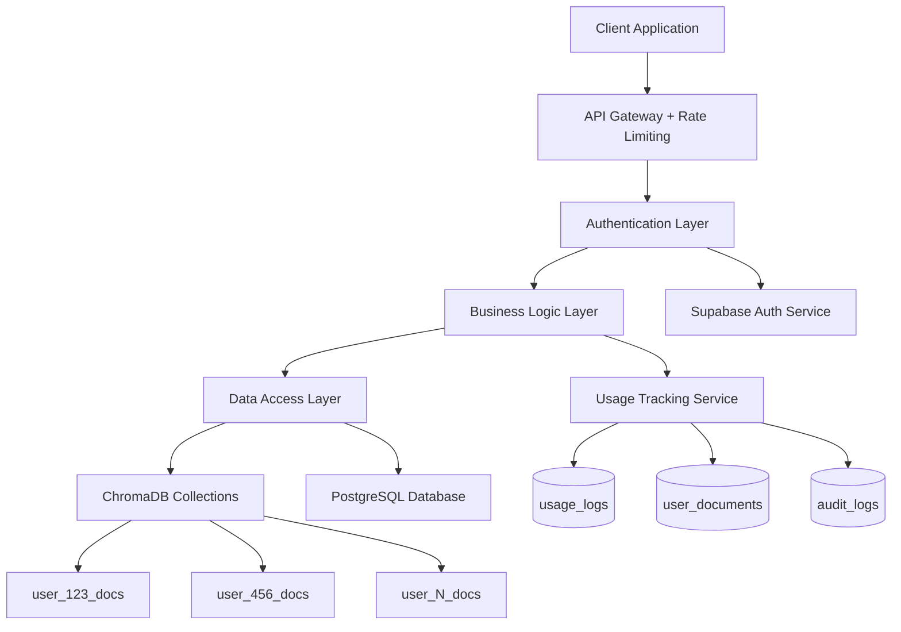
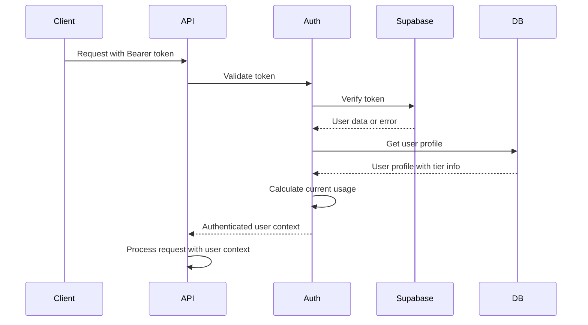
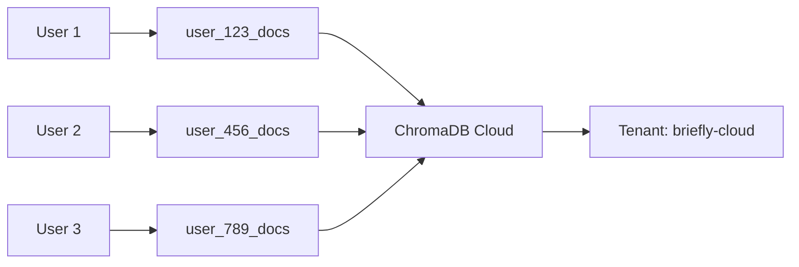

# Design Document

## Overview

This design document outlines the implementation of critical security patches for Briefly Cloud to address the three major vulnerabilities identified in the pre-launch assessment: authentication bypass, user data isolation, and usage tracking enforcement. The solution prioritizes immediate security fixes while maintaining backward compatibility with the existing FastAPI/React architecture.

The design focuses on surgical fixes to the existing codebase rather than architectural overhauls, ensuring rapid deployment of security patches. All changes leverage the current Supabase authentication, ChromaDB Cloud vector store, and PostgreSQL database infrastructure.

## Architecture

### Security Architecture Overview



### Authentication Flow



### User Isolation Architecture



## Components and Interfaces

### 1. Authentication Service Enhancement

**File**: `server/routes/auth.py`

**New Components**:
- `TokenValidator` class for centralized token validation
- `UserProfileManager` class for user profile operations
- `SessionManager` class for session expiry handling

**Key Interfaces**:
```python
class TokenValidator:
    async def validate_token(self, token: str) -> UserContext
    async def is_token_expired(self, token: str) -> bool
    async def invalidate_session(self, user_id: str) -> bool

class UserProfileManager:
    async def get_user_profile(self, user_id: str) -> UserProfile
    async def get_user_usage(self, user_id: str) -> UsageStats
    async def update_user_profile(self, user_id: str, updates: dict) -> UserProfile

class SessionManager:
    async def validate_session(self, token: str) -> bool
    async def refresh_session(self, token: str) -> str
    async def invalidate_expired_sessions(self) -> int
```

### 2. User Isolation Service

**File**: `server/vector_store.py`

**Enhanced Components**:
- `ChromaVectorStore` class with user-specific collection management
- `UserCollectionManager` for collection lifecycle management
- `IsolationValidator` for cross-user access prevention

**Key Interfaces**:
```python
class ChromaVectorStore:
    def __init__(self, user_id: str = None, collection_name: str = None)
    async def get_user_collection(self, user_id: str) -> Collection
    async def ensure_user_isolation(self, user_id: str, operation: str) -> bool

class UserCollectionManager:
    async def create_user_collection(self, user_id: str) -> Collection
    async def delete_user_collection(self, user_id: str) -> bool
    async def migrate_user_data(self, user_id: str, from_collection: str) -> bool

class IsolationValidator:
    def validate_user_access(self, user_id: str, resource_id: str) -> bool
    def sanitize_user_query(self, user_id: str, query: dict) -> dict
```

### 3. Usage Tracking Service

**File**: `server/services/usage_tracking.py` (new)

**New Components**:
- `UsageTracker` class for logging and monitoring usage
- `TierLimitEnforcer` class for subscription limit enforcement
- `UsageAnalytics` class for usage pattern analysis

**Key Interfaces**:
```python
class UsageTracker:
    async def log_usage(self, user_id: str, action: str, metadata: dict = None) -> bool
    async def get_user_usage(self, user_id: str, period: str = "month") -> UsageStats
    async def get_usage_by_action(self, user_id: str, action: str) -> int

class TierLimitEnforcer:
    async def check_usage_limits(self, user_id: str, action: str) -> bool
    async def get_tier_limits(self, tier: str) -> TierLimits
    async def enforce_document_limit(self, user_id: str) -> bool
    async def enforce_chat_limit(self, user_id: str) -> bool

class UsageAnalytics:
    async def get_usage_trends(self, user_id: str) -> dict
    async def predict_usage_patterns(self, user_id: str) -> dict
    async def generate_usage_report(self, user_id: str) -> dict
```

### 4. Rate Limiting Service

**File**: `server/middleware/rate_limiting.py` (new)

**New Components**:
- `UserRateLimiter` class for per-user rate limiting
- `RateLimitStore` class for rate limit state management
- `RateLimitMiddleware` for FastAPI integration

**Key Interfaces**:
```python
class UserRateLimiter:
    async def check_rate_limit(self, user_id: str, endpoint: str) -> bool
    async def increment_usage(self, user_id: str, endpoint: str) -> int
    async def get_remaining_requests(self, user_id: str, endpoint: str) -> int

class RateLimitStore:
    async def get_user_requests(self, user_id: str, window: str) -> int
    async def increment_requests(self, user_id: str, window: str) -> int
    async def reset_user_limits(self, user_id: str) -> bool
```

## Data Models

### Database Schema Updates

**New Tables**:

```sql
-- Usage tracking table
CREATE TABLE usage_logs (
    id UUID DEFAULT gen_random_uuid() PRIMARY KEY,
    user_id UUID REFERENCES auth.users(id) ON DELETE CASCADE,
    action VARCHAR(50) NOT NULL,
    metadata JSONB DEFAULT '{}',
    created_at TIMESTAMP WITH TIME ZONE DEFAULT NOW(),
    ip_address INET,
    user_agent TEXT
);

-- User documents tracking with soft delete
CREATE TABLE user_documents (
    id UUID DEFAULT gen_random_uuid() PRIMARY KEY,
    user_id UUID REFERENCES auth.users(id) ON DELETE CASCADE,
    file_name VARCHAR(255) NOT NULL,
    file_size INTEGER,
    file_type VARCHAR(50),
    storage_provider VARCHAR(20),
    chroma_collection VARCHAR(100),
    indexed_at TIMESTAMP WITH TIME ZONE DEFAULT NOW(),
    deleted_at TIMESTAMP WITH TIME ZONE NULL,
    metadata JSONB DEFAULT '{}'
);

-- Audit logs for administrative actions
CREATE TABLE audit_logs (
    id UUID DEFAULT gen_random_uuid() PRIMARY KEY,
    admin_id UUID REFERENCES auth.users(id),
    target_user_id UUID REFERENCES auth.users(id),
    action VARCHAR(100) NOT NULL,
    old_value JSONB,
    new_value JSONB,
    metadata JSONB DEFAULT '{}',
    created_at TIMESTAMP WITH TIME ZONE DEFAULT NOW()
);

-- Rate limiting state
CREATE TABLE rate_limits (
    id UUID DEFAULT gen_random_uuid() PRIMARY KEY,
    user_id UUID REFERENCES auth.users(id) ON DELETE CASCADE,
    endpoint VARCHAR(100) NOT NULL,
    requests_count INTEGER DEFAULT 0,
    window_start TIMESTAMP WITH TIME ZONE DEFAULT NOW(),
    created_at TIMESTAMP WITH TIME ZONE DEFAULT NOW(),
    UNIQUE(user_id, endpoint, window_start)
);
```

**Enhanced User Profile Model**:
```python
class UserProfile(BaseModel):
    id: str
    email: str
    plan: str  # 'free', 'pro', 'pro_byok'
    stripe_customer_id: Optional[str] = None
    api_key_hash: Optional[str] = None
    current_usage: UsageStats
    tier_limits: TierLimits
    created_at: datetime
    updated_at: datetime
    last_login: Optional[datetime] = None

class UsageStats(BaseModel):
    chat_requests: int
    document_uploads: int
    documents_stored: int
    current_period: str
    period_start: datetime
    period_end: datetime

class TierLimits(BaseModel):
    max_files: int
    max_llm_calls: int
    max_file_size_mb: int
    features: List[str]
    rate_limit_per_minute: int
```

### Tier Configuration

```python
TIER_LIMITS = {
    'free': TierLimits(
        max_files=10,
        max_llm_calls=50,
        max_file_size_mb=10,
        features=['basic_chat', 'pdf_upload'],
        rate_limit_per_minute=10
    ),
    'pro': TierLimits(
        max_files=1000,
        max_llm_calls=1000,
        max_file_size_mb=100,
        features=['advanced_chat', 'all_formats', 'priority_support'],
        rate_limit_per_minute=60
    ),
    'pro_byok': TierLimits(
        max_files=10000,
        max_llm_calls=-1,  # Unlimited with own API key
        max_file_size_mb=500,
        features=['advanced_chat', 'all_formats', 'priority_support', 'own_api_key'],
        rate_limit_per_minute=120
    )
}
```

## Error Handling

### Centralized Error Response System

**File**: `server/utils/error_handling.py` (new)

```python
class SecurityError(HTTPException):
    def __init__(self, detail: str, status_code: int = 401):
        super().__init__(status_code=status_code, detail=detail)

class UsageLimitError(HTTPException):
    def __init__(self, detail: str, current_usage: int, limit: int):
        super().__init__(
            status_code=429, 
            detail=detail,
            headers={"X-Usage-Current": str(current_usage), "X-Usage-Limit": str(limit)}
        )

class IsolationError(HTTPException):
    def __init__(self, detail: str = "Access denied to resource"):
        super().__init__(status_code=403, detail=detail)

async def security_error_handler(request: Request, exc: SecurityError):
    logger.warning(f"Security error for {request.client.host}: {exc.detail}")
    return JSONResponse(
        status_code=exc.status_code,
        content={"error": "Authentication required", "code": "AUTH_REQUIRED"}
    )

async def usage_limit_error_handler(request: Request, exc: UsageLimitError):
    logger.info(f"Usage limit exceeded for user: {exc.detail}")
    return JSONResponse(
        status_code=exc.status_code,
        content={
            "error": "Usage limit exceeded", 
            "code": "USAGE_LIMIT_EXCEEDED",
            "upgrade_url": "/pricing"
        }
    )
```

### Error Response Standards

All API errors will follow this consistent format:
```json
{
    "error": "Human readable error message",
    "code": "MACHINE_READABLE_CODE",
    "details": {
        "field": "specific error details"
    },
    "timestamp": "2024-01-15T10:30:00Z",
    "request_id": "uuid-for-tracking"
}
```

## Testing Strategy

### Security Test Suite

**File**: `tests/test_security.py` (new)

**Test Categories**:

1. **Authentication Tests**:
   - Token validation with valid/invalid tokens
   - Session expiry handling
   - Mock user bypass prevention
   - Unauthorized access attempts

2. **User Isolation Tests**:
   - Cross-user data access prevention
   - Collection isolation verification
   - Document search isolation
   - Vector store user separation

3. **Usage Limit Tests**:
   - Tier limit enforcement
   - Usage tracking accuracy
   - Limit exceeded responses
   - Usage reset functionality

4. **Rate Limiting Tests**:
   - Per-user rate limit enforcement
   - Rate limit window behavior
   - Rate limit bypass prevention
   - Rate limit reset functionality

### Integration Test Framework

```python
class SecurityTestSuite:
    async def test_authentication_required(self):
        """Verify all protected endpoints require authentication"""
        
    async def test_user_isolation(self):
        """Verify users can only access their own data"""
        
    async def test_usage_limits_enforced(self):
        """Verify tier limits are properly enforced"""
        
    async def test_rate_limiting_works(self):
        """Verify rate limiting prevents abuse"""
        
    async def test_audit_logging(self):
        """Verify administrative actions are logged"""

class LoadTestSuite:
    async def test_concurrent_user_isolation(self):
        """Test isolation under concurrent load"""
        
    async def test_rate_limit_under_load(self):
        """Test rate limiting under high load"""
        
    async def test_usage_tracking_accuracy(self):
        """Test usage tracking accuracy under load"""
```

### Automated Security Scanning

**CI/CD Integration**:
- Pre-commit hooks for security linting
- Automated dependency vulnerability scanning
- API security testing in CI pipeline
- Performance regression testing

## Implementation Phases

### Phase 1: Core Security (Days 1-3)
1. Remove authentication bypass in `auth.py`
2. Implement proper token validation
3. Add user isolation to `vector_store.py`
4. Create usage tracking service
5. Update database schema

### Phase 2: Production Configuration (Days 4-5)
1. Update environment configuration
2. Implement rate limiting middleware
3. Add comprehensive error handling
4. Configure production CORS settings
5. Disable debug mode

### Phase 3: Testing & Validation (Days 6-7)
1. Create comprehensive security test suite
2. Implement integration tests
3. Add automated regression testing
4. Performance testing under load
5. Security audit and penetration testing

### Phase 4: Monitoring & Audit (Day 8)
1. Implement audit logging
2. Add usage analytics dashboard
3. Create monitoring alerts
4. Document security procedures
5. Final security review

## Security Considerations

### Defense in Depth Strategy

1. **API Gateway Level**: Rate limiting and request validation
2. **Authentication Level**: Token validation and session management
3. **Authorization Level**: User isolation and permission checking
4. **Data Level**: Encrypted storage and access controls
5. **Monitoring Level**: Audit logging and anomaly detection

### Threat Mitigation

| Threat | Current Risk | Mitigation Strategy |
|--------|-------------|-------------------|
| Authentication Bypass | Critical | Remove mock override, implement proper validation |
| Data Leakage | Critical | User-specific collections, access validation |
| Usage Fraud | High | Comprehensive tracking, tier enforcement |
| Rate Limit Abuse | Medium | Per-user rate limiting, progressive penalties |
| Session Hijacking | Medium | Token expiry, session invalidation |
| Privilege Escalation | Low | Audit logging, role-based access |

### Compliance Considerations

- **GDPR**: User data isolation, deletion capabilities, audit trails
- **SOC 2**: Access controls, monitoring, incident response
- **PCI DSS**: Secure payment processing (Stripe handles this)
- **CCPA**: Data privacy controls, user data export/deletion

This design provides a comprehensive security foundation while maintaining system performance and user experience. The phased implementation approach allows for incremental deployment with thorough testing at each stage.