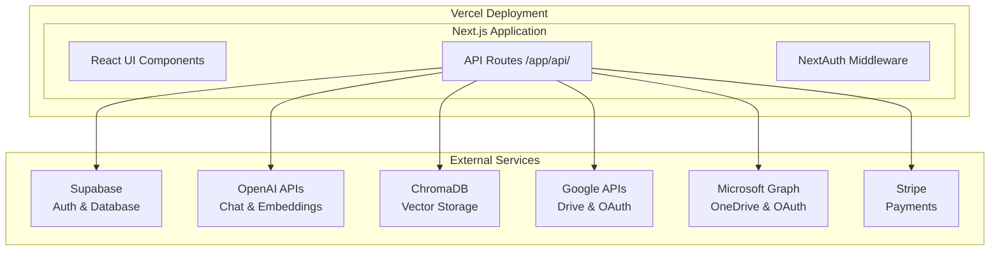

# 🚀 Briefly Cloud – AI-Powered Productivity Assistant

Transform your documents into intelligent conversations with AI — powered by GPT-4 Turbo and cutting-edge vector search technology.

> **🎉 New Unified Architecture**: Migrated from Python FastAPI + React to unified Next.js for better performance, eliminated CORS issues, and simplified deployment.

---

## Overview

**Briefly Cloud** is a unified Next.js AI productivity assistant that enables intelligent conversations with your documents. Built with a modern TypeScript architecture, it eliminates CORS issues and provides seamless integration between frontend and backend functionality.

### Key Capabilities
- Chat with your documents using GPT-4 Turbo
- Upload and process multiple document formats
- Connect Google Drive and OneDrive for cloud document access
- Semantic search across all your content
- Subscription-based usage with flexible tiers

---

## ✨ Key Features

### 🤖 AI & Intelligence
- **GPT-4 Turbo Integration**: Advanced AI conversations with document context
- **BYOK Support**: Bring Your Own Key for cost optimization
- **Vector Search**: ChromaDB-powered semantic search across documents
- **Smart Embeddings**: OpenAI text-embedding-3-small for accurate retrieval

### 📄 Document Processing
- **Multi-Format Support**: PDF, DOCX, TXT, MD, CSV, XLSX, PPTX
- **Intelligent Chunking**: Optimized text segmentation for better AI responses
- **Metadata Preservation**: File information and source tracking
- **Batch Processing**: Handle multiple documents efficiently

### ☁️ Cloud Integration
- **Google Drive**: OAuth integration with file selection
- **OneDrive**: Microsoft Graph API integration
- **Direct Upload**: Drag-and-drop file upload interface
- **Secure Storage**: Supabase storage with encryption

### 🛡️ Security & Compliance
- **GDPR Compliance**: Full data protection and user rights
- **Accessibility**: WCAG 2.1 AA compliance with audit tools
- **NextAuth.js**: Secure OAuth authentication
- **Data Encryption**: End-to-end security measures

### 🚀 Modern Architecture
- **Unified Next.js**: Single codebase for frontend and backend
- **TypeScript**: End-to-end type safety
- **No CORS Issues**: Colocated frontend and API
- **Vercel Deployment**: Optimized for performance and scalability

### 🎛️ Advanced Features
- **Feature Flags**: Staged rollout system with A/B testing
- **Usage Analytics**: Comprehensive monitoring and insights
- **Error Handling**: Robust error boundaries and retry mechanisms
- **Performance Monitoring**: Real-time performance tracking

---

## 💰 Subscription Pricing & Limits

| Tier         | Price      | Documents | Messages/mo | Storage | Features                               |
|--------------|------------|-----------|-------------|---------|----------------------------------------|
| **Free**     | $0         | 25        | 100         | 100 MB  | GPT-3.5 Turbo, basic chat, Google Drive|
| **Pro**      | $30/mo     | 500       | 400         | 1 GB    | GPT-4 Turbo, advanced search, Google/OneDrive|
| **Pro BYOK** | $15/mo     | 5,000     | 2,000       | 10 GB   | Bring your own OpenAI API key          |

*BYOK = Bring Your Own Key (user supplies OpenAI API key to reduce cost)*

---

## 🚀 Quick Start

### Prerequisites

- **Node.js 18+** and npm
- **Supabase account** for database and authentication
- **OpenAI API key** for AI functionality
- **OAuth credentials** for Google/Microsoft integration

### Installation

```bash
# Clone the repository
git clone https://github.com/your-org/briefly-cloud.git
cd Briefly_Cloud

# Install dependencies for the Next.js app
npm run install-all

# Copy environment template
cd briefly-cloud-nextjs
cp .env.example .env.local

# Configure your environment variables
# Edit .env.local with your API keys and configuration
```

### Environment Setup

Create `.env.local` in the `briefly-cloud-nextjs` directory:

```env
# NextAuth.js
NEXTAUTH_SECRET=your-nextauth-secret
NEXTAUTH_URL=http://localhost:3000

# Supabase
NEXT_PUBLIC_SUPABASE_URL=your-supabase-url
SUPABASE_SERVICE_ROLE_KEY=your-supabase-service-role-key

# OpenAI
OPENAI_API_KEY=your-openai-api-key

# OAuth Providers
GOOGLE_CLIENT_ID=your-google-client-id
GOOGLE_CLIENT_SECRET=your-google-client-secret
MICROSOFT_CLIENT_ID=your-microsoft-client-id
MICROSOFT_CLIENT_SECRET=your-microsoft-client-secret

# Stripe (for subscriptions)
STRIPE_SECRET_KEY=your-stripe-secret-key
STRIPE_WEBHOOK_SECRET=your-stripe-webhook-secret

# ChromaDB (optional - defaults to local)
CHROMADB_URL=your-chromadb-url
```

### Development

```bash
# Start the development server
npm run dev

# Run tests
npm run test

# Run end-to-end tests
npm run test:e2e

# Type checking
npm run type-check

# Linting
npm run lint
```

Access the application:
- **Frontend**: http://localhost:3000
- **API Routes**: http://localhost:3000/api/*

---

## 🏗️ Architecture

### Unified Next.js Application



### Technology Stack

- **Frontend**: React 18, TypeScript, TailwindCSS, Radix UI
- **Backend**: Next.js 14 API Routes, TypeScript
- **Authentication**: NextAuth.js with OAuth providers
- **Database**: Supabase PostgreSQL with Row Level Security
- **Vector Search**: ChromaDB with JavaScript client
- **AI**: OpenAI GPT-4 Turbo and embeddings
- **Payments**: Stripe integration
- **Deployment**: Vercel with automatic scaling

### Project Structure

```
Briefly_Cloud/
├── briefly-cloud-nextjs/          # Main Next.js application
│   ├── src/app/                   # Next.js App Router
│   │   ├── api/                   # API route handlers
│   │   │   ├── auth/              # NextAuth.js authentication
│   │   │   ├── upload/            # File upload endpoints
│   │   │   ├── embed/             # Document processing
│   │   │   ├── chat/              # AI chat functionality
│   │   │   ├── storage/           # Cloud storage integration
│   │   │   ├── feature-flags/     # Feature flag management
│   │   │   └── gdpr/              # GDPR compliance tools
│   │   ├── components/            # React components
│   │   ├── lib/                   # Utility functions
│   │   ├── legal/                 # Terms of Service, Privacy Policy
│   │   └── types/                 # TypeScript type definitions
│   ├── tests/                     # Test suites (Jest + Playwright)
│   ├── docs/                      # Technical documentation
│   └── database/                  # Database schemas and migrations
├── legacy-python-backup/          # Archived legacy components
├── Docs/                          # Project documentation
└── README.md                      # This file
```

---

## 🧪 Testing

### Test Suites

```bash
# Unit tests (Jest)
npm run test

# End-to-end tests (Playwright)
npm run test:e2e

# Test with coverage
npm run test:coverage

# Watch mode for development
npm run test:watch
```

### Test Coverage

- **API Routes**: Comprehensive testing of all endpoints
- **Components**: React Testing Library for UI components
- **Integration**: Full user journey testing
- **Accessibility**: WCAG compliance verification

---

## 🚀 Deployment

### Vercel Deployment

1. **Connect Repository**: Link your GitHub repository to Vercel
2. **Environment Variables**: Configure all required environment variables
3. **Deploy**: Automatic deployment on push to main branch

### Environment Variables (Production)

Configure these in your Vercel dashboard:

- `NEXTAUTH_SECRET` - NextAuth.js secret
- `NEXT_PUBLIC_SUPABASE_URL` - Supabase project URL
- `SUPABASE_SERVICE_ROLE_KEY` - Supabase service role key
- `OPENAI_API_KEY` - OpenAI API key
- `GOOGLE_CLIENT_ID` & `GOOGLE_CLIENT_SECRET` - Google OAuth
- `MICROSOFT_CLIENT_ID` & `MICROSOFT_CLIENT_SECRET` - Microsoft OAuth
- `STRIPE_SECRET_KEY` & `STRIPE_WEBHOOK_SECRET` - Stripe integration

### Custom Domain

Configure your custom domain in Vercel dashboard and update:
- `NEXTAUTH_URL` to your production URL
- OAuth redirect URLs in Google/Microsoft consoles

---

## 📚 Documentation

### Technical Documentation
- [Legal Compliance System](briefly-cloud-nextjs/docs/LEGAL_COMPLIANCE_SYSTEM.md) - GDPR and accessibility
- [Feature Flags System](briefly-cloud-nextjs/docs/FEATURE_FLAGS_SYSTEM.md) - Staged rollouts and A/B testing
- [Migration Guide](briefly-cloud-nextjs/docs/MIGRATION_GUIDE.md) - Legacy to Next.js migration
- [API Reference](briefly-cloud-nextjs/docs/API_STRUCTURE_IMPLEMENTATION.md) - API endpoints

### Setup Guides
- [File Upload System](briefly-cloud-nextjs/docs/FILE_UPLOAD_SYSTEM.md) - Document processing
- [Document Text Extraction](briefly-cloud-nextjs/docs/DOCUMENT_TEXT_EXTRACTION.md) - Text processing
- [OpenAI Embeddings Integration](briefly-cloud-nextjs/docs/OPENAI_EMBEDDINGS_INTEGRATION.md) - AI setup

### Legacy Information
- [Legacy Cleanup Report](LEGACY_CLEANUP_REPORT.md) - Migration cleanup details

---

## 🤝 Contributing

We welcome contributions! Please see our contributing guidelines:

1. **Fork the repository**
2. **Create a feature branch**: `git checkout -b feature/amazing-feature`
3. **Commit your changes**: `git commit -m 'Add amazing feature'`
4. **Push to the branch**: `git push origin feature/amazing-feature`
5. **Open a Pull Request**

### Development Guidelines

- **TypeScript**: All code must be properly typed
- **Testing**: Include tests for new features
- **Documentation**: Update documentation for API changes
- **Accessibility**: Ensure WCAG 2.1 AA compliance
- **Performance**: Consider performance impact of changes

---

## 🆘 Support

### Getting Help

- **Documentation**: Check the docs/ directory for detailed guides
- **Issues**: Report bugs or request features on GitHub Issues
- **Email**: support@rekonnlabs.com for direct support
- **Community**: Join our Discord community (link coming soon)

### Common Issues

- **CORS Errors**: Should not occur with unified architecture
- **Authentication Issues**: Check OAuth configuration
- **File Upload Problems**: Verify file size limits and formats
- **Performance Issues**: Check database queries and caching

---

## 📄 License

This project is licensed under the MIT License - see the [LICENSE](LICENSE) file for details.

---

## 🙏 Acknowledgments

- **OpenAI** — GPT-4 Turbo API & Embeddings
- **Vercel** — Unified deployment platform and Next.js framework
- **Supabase** — Database and authentication services
- **ChromaDB** — Vector database for semantic search
- **Stripe** — Payment processing and subscription management
- **NextAuth.js** — Authentication library
- **Radix UI** — Accessible component primitives
- **TailwindCSS** — Utility-first CSS framework

---

## 🔄 Migration from Legacy Architecture

This project has been migrated from a Python FastAPI + React architecture to a unified Next.js application. The migration provides:

### Benefits
- ✅ **Eliminated CORS issues** between frontend and backend
- ✅ **Simplified deployment** with single Vercel project
- ✅ **Improved performance** with Next.js optimizations
- ✅ **Better developer experience** with unified codebase
- ✅ **Enhanced type safety** with end-to-end TypeScript

### Legacy Components
All legacy Python and React components have been archived in `legacy-python-backup/` for reference and potential rollback if needed.

For detailed migration information, see [Legacy Cleanup Report](LEGACY_CLEANUP_REPORT.md).

---

Built with ❤️ by **RekonnLabs** — transforming knowledge work with AI.

*Empowering productivity through intelligent document conversations.*