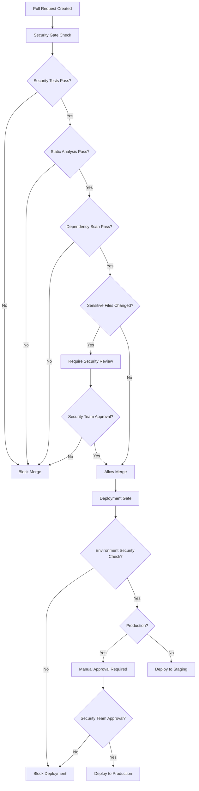

# Security Gates Documentation

## Overview

Security gates are automated checks that prevent code from being merged or deployed if security requirements are not met. This system implements multiple layers of security validation to ensure the integrity and security of the Briefly Cloud application.

## Security Gate Types

### 1. Pull Request Security Gates

Automatically triggered on pull requests to `main` and `develop` branches.

#### Components:
- **Security Test Execution**: Runs comprehensive security test suite
- **Static Analysis**: ESLint security rules and Semgrep scanning
- **Dependency Scanning**: npm audit for vulnerability detection
- **Sensitive File Detection**: Identifies changes to security-critical files
- **Regression Testing**: Validates security controls remain intact

#### Configuration:
- Workflow: `.github/workflows/security-gates.yml`
- Branch Protection: `.github/branch-protection-config.json`
- Code Owners: `.github/CODEOWNERS`

### 2. Deployment Security Gates

Validates security requirements before allowing deployment to staging or production.

#### Components:
- **Security Test Validation**: All security tests must pass
- **Configuration Validation**: Security headers, environment variables
- **Performance Benchmarks**: Security overhead within acceptable limits
- **Environment Security**: Production-specific security requirements

#### Configuration:
- Workflow: `.github/workflows/deployment-security.yml`
- Script: `scripts/deployment-security-gate.js`

### 3. Manual Security Review Gates

Requires human approval for sensitive changes.

#### Triggers:
- Changes to authentication/authorization code
- Database schema modifications
- Security configuration changes
- Admin endpoint modifications
- Middleware changes

## Security Gate Workflow



## Branch Protection Rules

### Main Branch
- **Required Status Checks**: All security gates must pass
- **Required Reviews**: 2 approving reviews required
- **Code Owner Reviews**: Required for sensitive files
- **Admin Enforcement**: Enabled
- **Linear History**: Required
- **Force Push**: Disabled

### Develop Branch
- **Required Status Checks**: Security gates must pass
- **Required Reviews**: 1 approving review required
- **Admin Enforcement**: Disabled
- **Force Push**: Disabled

## Security Labels

Automatically applied based on changes:

- `security-review-required`: Manual security review needed
- `security-critical`: Critical security changes
- `security-enhancement`: Security improvements
- `security-fix`: Security vulnerability fixes
- `security-approved`: Approved by security team

## Sensitive File Patterns

Files that trigger mandatory security review:

```
/database/                 # Database schemas and migrations
/src/app/lib/auth/        # Authentication logic
/src/app/lib/security/    # Security utilities
/middleware.ts            # Request middleware
/next.config.js           # Next.js configuration
/.github/workflows/       # CI/CD workflows
/src/app/api/admin/       # Admin endpoints
/scripts/                 # Build and deployment scripts
```

## Security Test Categories

### 1. Authentication Security Tests
- JWT token validation
- Session management
- Authentication bypass prevention
- Failed login attempt handling

### 2. Authorization Tests
- Row Level Security (RLS) policy enforcement
- Cross-user data access prevention
- Admin privilege validation
- Resource ownership verification

### 3. Rate Limiting Tests
- Rate limit enforcement across time windows
- Rate limit bypass prevention
- Usage tracking accuracy
- Tier-based limit validation

### 4. Audit Logging Tests
- Audit log generation for sensitive operations
- Security event logging
- Audit log access controls
- Log integrity validation

### 5. Input Validation Tests
- SQL injection prevention
- XSS prevention
- File upload security
- Input sanitization

## Performance Benchmarks

Security gates include performance validation to ensure security controls don't degrade system performance:

### Benchmarks:
- **Authentication Latency**: < 100ms average
- **Rate Limiting Overhead**: < 10ms additional latency
- **Audit Logging Performance**: < 50ms average logging time
- **Vector Search Security**: < 200ms with RLS enforcement

## Setup Instructions

### 1. Install Dependencies

```bash
npm install
```

### 2. Configure Branch Protection

```bash
# Set up branch protection rules (requires GITHUB_TOKEN)
export GITHUB_TOKEN="your_github_token"
npm run setup:branch-protection

# Validate configuration
npm run setup:branch-protection:validate
```

### 3. Validate Security Gates

```bash
# Run security gate validation
npm run security:gate:validate

# Run full security test suite
npm run test:security

# Run security regression tests
npm run test:security:regression
```

### 4. Test Deployment Gates

```bash
# Test staging deployment gate
npm run deployment:security:gate:staging

# Test production deployment gate
npm run deployment:security:gate:production
```

## Environment Variables

Required for security gates:

```bash
# Supabase Configuration
SUPABASE_URL=your_supabase_url
SUPABASE_ANON_KEY=your_anon_key
SUPABASE_SERVICE_ROLE_KEY=your_service_role_key

# Authentication
NEXTAUTH_SECRET=your_nextauth_secret
NEXTAUTH_URL=your_app_url

# GitHub (for branch protection setup)
GITHUB_TOKEN=your_github_token
GITHUB_REPOSITORY_OWNER=your_org
GITHUB_REPOSITORY_NAME=your_repo
```

## Security Team Setup

### 1. Create Security Team

```bash
# Create security team in GitHub organization
npm run setup:branch-protection -- --setup-team
```

### 2. Add Team Members

Add security team members in GitHub organization settings:
- Navigate to Organization → Teams → security-team
- Add members with appropriate permissions

### 3. Configure Notifications

Set up notifications for security reviews:
- Slack/Teams integration for security-review-required label
- Email notifications for security team mentions
- Dashboard for pending security reviews

## Troubleshooting

### Common Issues

#### 1. Security Tests Failing
```bash
# Run specific security test category
npm run test:security:auth
npm run test:security:rls
npm run test:security:rate-limiting

# Check test logs
npm run test:security -- --verbose
```

#### 2. Static Analysis Issues
```bash
# Run security linting with fixes
npm run lint:security:fix

# Run Semgrep with detailed output
npm run security:scan -- --verbose
```

#### 3. Dependency Vulnerabilities
```bash
# Check for vulnerabilities
npm audit

# Attempt automatic fixes
npm audit fix

# Check for high/critical only
npm audit --audit-level=high
```

#### 4. Branch Protection Not Working
```bash
# Validate current protection settings
npm run setup:branch-protection:validate

# Re-apply protection rules
npm run setup:branch-protection
```

### Debug Mode

Enable debug logging for security gates:

```bash
# Set debug environment variable
export DEBUG=security:*

# Run with verbose output
npm run security:gate:validate -- --verbose
npm run deployment:security:gate -- --verbose
```

## Security Gate Reports

All security gates generate detailed reports:

### Report Locations:
- `security-gate-report.json`: Pull request security validation
- `security-regression-report.json`: Regression test results
- `security-performance-report.json`: Performance benchmark results
- `deployment-security-report-{env}.json`: Deployment validation
- `security-gate-validation-report.json`: Gate configuration validation

### Report Structure:
```json
{
  "timestamp": "2024-01-01T00:00:00.000Z",
  "environment": "production",
  "summary": {
    "total": 15,
    "passed": 14,
    "failed": 1,
    "warnings": 0,
    "success_rate": 93.33
  },
  "checks": [
    {
      "category": "Security Tests",
      "message": "All security tests passed",
      "status": "passed",
      "timestamp": "2024-01-01T00:00:00.000Z"
    }
  ]
}
```

## Continuous Improvement

### Metrics to Monitor:
- Security gate pass/fail rates
- Time to resolve security issues
- False positive rates
- Security review turnaround time

### Regular Reviews:
- Monthly security gate effectiveness review
- Quarterly security test coverage analysis
- Annual security gate process improvement

## Contact

For security gate issues or questions:
- Security Team: @security-team
- DevOps Team: @devops-team
- Documentation: [Security Documentation](./SECURITY_INCIDENT_RESPONSE.md)